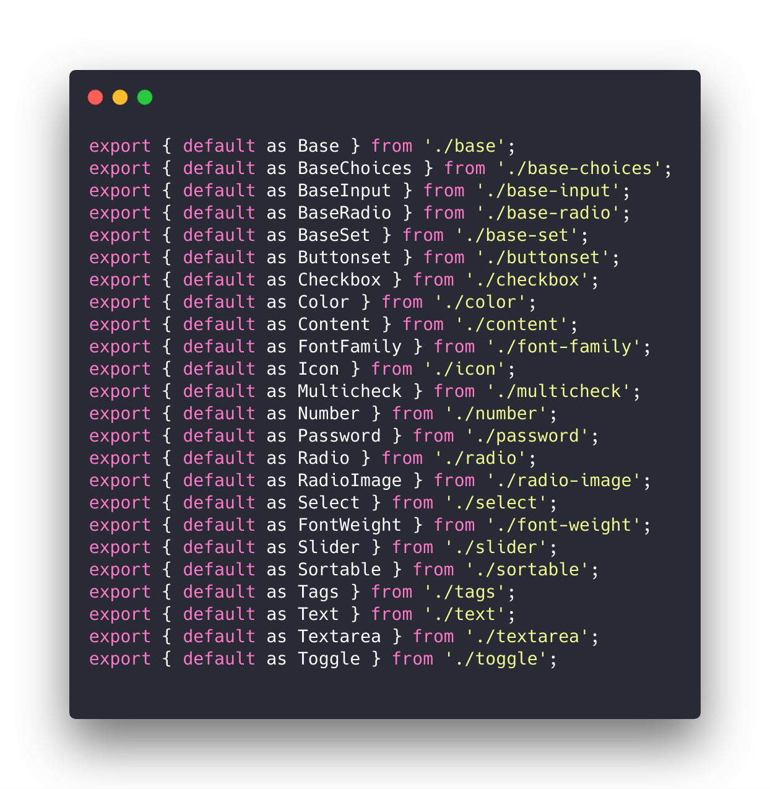

# Controls

## Custom controls




1. [**text / email / url**](text)
2. **textarea** / **wp_editor**
3. [**number**](number)
4. [**toggle** / **switch** / **checkbox**](toggle)
5. **radio** / **radio image** / **buttonset**
6. [**multicheck** / **multicheck sortable**](multicheck)
7. **slider**
8. **color** / **alpha** / **palette** / **transparent**
9. **font family** / **font weight**
10. **select** / **dropdown** / **multiselect** / **sortable multiselect**
11. **sortable**
12. **tags / sortable tags**
13. **icons**
14. **content** / **markdown**
15. **WordPress native controls***
16. **dynamic color** *(Premium)*
17. **dynamic size** *(Premium)*
18. **datepicker** *(Premium)*
19. **knob** *(Premium)*

On current development:

20. **number spinner**
21. **google font**
22. **masked text** *(Premium)*
23. **timepicker** *(Premium)*
24. **text shadow** *(Premium)*
25. **autocomplete** *(Premium)*
26. **custom icons set** *(Premium)*
27. **image manipulator** *(Premium)*

You can still use all the WordPress native controls as you can see [in the demo](/demos#customize-plus), in this case you are in charge to handle the sanitization, defininig a 'sanitization_callback' (see [WordPress docs](https://codex.wordpress.org/Validating_Sanitizing_and_Escaping_User_Data)). [Sanitization](/docs/customize-plus/advanced/sanitization) and [validation](/docs/customize-plus/advanced/validation) is instead built in in all Customize Plus controls .

## Reset control's values

Each custom control's default setting can be resetted in three ways:

- `Reset to last saved value` which restore the setting value to the last saved one. So pressing the Save button while  you're customizing your website will change the effect of this reset action.
- `Reset to initial session value` which brings the setting to the value it had when the Customize page has loaded. The difference with the above reset action is that this does not care about the different values that have been stored when pressing the Save button, it will always reset to the value as it was when the page has just loaded, which should also be the last value stored in the database before opening the Customize screen.
- `Reset to factory value`. This brings the setting value to its default value as defined by your current theme developers.

## Controls shared properties

```php

/**
 * Optional value
 *
 * Whether this control setting value is optional, in other words, when its
 * setting is allowed to be empty.
 *
 * @since 1.0.0
 * @var bool
 */
optional => false,

/**
 * Loose (allows human error to be previewed)
 *
 * Whether this control allows the user to set and preview an invalid value.
 * The value will not be saved anyway. In fact when this option (applyable
 * on all controls) is set to `true` the user will both see the notification
 * error sent from JavaScript in the frontend AND the one from the backend.
 * Since notifications are the same they will not be duplicated.
 * When this option is set to `false` the user will not be able to preview
 * an invalid value in the customizer preview, and the last valid value will
 * always be the one both previewed and sent to the server.
 *
 * @see JS kkcp.controls.Base->_validate
 * @see JS kkcp.controls.Base->sanitize
 *
 * @since 1.0.0
 * @var bool
 */
'loose' => false,

/**
 * Enable live validation of control's default setting value
 *
 * For readibility this property is 'positively' put. But in the JSON `params`
 * it is reversed in its negative form, so that the `control.params` object
 * get another property only in the less frequent case and prints a slightly
 * smaller JSON. In `to_json` this becomes `noLiveValidation`.
 *
 * @see JS kkcp.controls.Base->initialize
 *
 * @since 1.0.0
 * @var bool
 */
'live_validation' => true,

/**
 * Enable live sanitization of control's default setting value
 *
 * For readibility this property is 'positively' put. But in the JSON `params`
 * it is reversed in its negative form, so that the `control.params` object
 * get another property only in the less frequent case and prints a slightly
 * smaller JSON. In `to_json` this becomes `noLiveSanitization`.
 *
 * @see JS kkcp.controls.Base->initialize
 *
 * @since 1.0.0
 * @var bool
 */
'live_sanitization' => true,
```

### JS API

- Completely destroy a Cusotmize Plus control (unbinds it and remove its container) :

```js
new wp.customize.control('slider').destroy();
```

- Instantiate a new Cusotmize Plus control on the fly with e.g.

```js
new kkcp.controls.Slider('slider', {
  section: 'section-sizes',
  setting: 'slider-em',
  label:'New slider!',
  description: 'A dynamically instantiated control'
})
```
